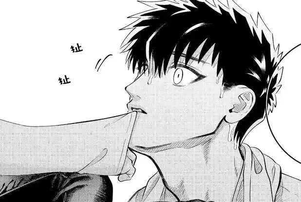
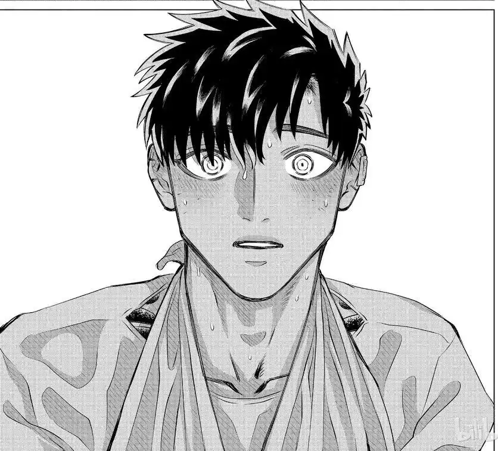

I recently have read/watch some incredible (at least for current me) 作品, and I can't help loving them... omg... You gotta read/watch them!!!

Later I'll write some comments on them.

- Kirishima Miyama (from Yakuza Fiancé: Raise wa Tanin ga Ii).
Omg, he's so cute and hot!!! Who can refuse the Golden Retriever!!!

  
  

- Everything, everywhere all at once. (EEAAO)
I was crying a lot from the beginning. The faults I've done, the pains I've swallowed and the sorrows I've brought are too heavy to carry. I have to keep them away to keep my heart safe, even it is not sound.

I was tired, too, several months ago. My parents are so kind—too kind—that I can’t bring myself to ask for their support. They would come to see me and protect me at all their cost, which I can't burden anymore. I've hurt so many peolple, that sometimes I feel that all I've done before are totally wrong.

Finally I figure out (maybe it's wrong too) that just don't expect from myself, not a little thing. Let the life leads me to where I will be, and I watch it, and then I die.

Please... don't expect too much from me. Just let me ... go...
